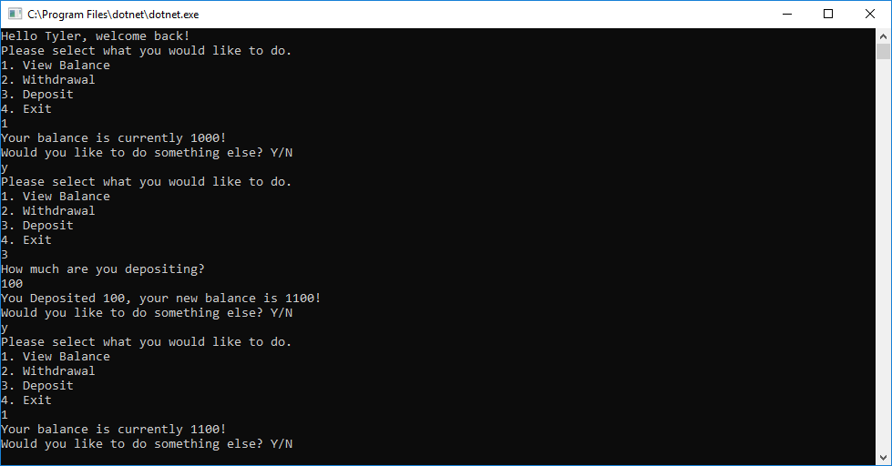

# Lab--UnitTest

<h1>Welcome to the ATM:</h1>

<h2>Summary:</h2>

The goal of this is for the user ("Tyler") to check and withdraw/deposit into his awesome bank via this ATM!

<h2>Setup:</h2>

-Open VS community  
-Create new project  
-Go to File  
-New  
-New Project  
-In the window on the left you will see a .NET Core option under Visual C# make sure you have that selected  
-Now in the middle section select Console App (.NET Core)  
-Next in the bottom change the name to your choice and change path if you want and then click "Ok"  
-Next click view  
-Then Solution Explorer  
-If it wasnt already there it will open a tab on the right side showing your Solution Explorer  
-Next click on the tiny folder tab in the Solution explorer tab the change to Solution Explorer - Folder View  
-Navigate to Program.cs file and double click to open it  
-Once you have that open copy and paste the source code below into the Program.cs file  
-Hit control S to save the source code you pasted into your file  
-Now go back up to the Solution Explorer - Folder View and hit the little folder tab to change back to the just the Solution Explorer  
-Now its time to run the code in the top nav bar hit Debug  
-Then Click Start Debug to get access to Tylers money!  

<h2>Source Code:</h2>

    using System;

namespace UnitTesting
{
    public class Program
    {
        static void Main(string[] args)
        {
            string startingBalance = "1000";
            string currentUser = "Tyler";
            FirstLoadUI(currentUser, startingBalance);
        }//closing Main

        static void FirstLoadUI(string user, string currentBalance)
        {
            Console.WriteLine($"Hello {user}, welcome back!");
            Interface(user, currentBalance);
        }//closing FirstLoadUI

        static void Interface(string user, string balance)
        {
            Console.WriteLine("Please select what you would like to do.");
            Console.WriteLine("1. View Balance");
            Console.WriteLine("2. Withdrawal");
            Console.WriteLine("3. Deposit");
            Console.WriteLine("4. Exit");

            string input = Console.ReadLine();

            if (input == "1")
            {
                string newBalance = Balance(user, balance);
                Console.WriteLine($"Your balance is currently {newBalance}!");
                Continue(user, newBalance);
            }
            if (input == "2")
            {
                Console.WriteLine("How much would you like to withdraw?");
                string withdrawal = Console.ReadLine();
                if (CheckInput(withdrawal))
                {
                    string newBalance = Withdraw(user, balance, withdrawal);
                    
                    if (CheckBalance(newBalance)) 
                    {
                        Console.WriteLine($"You Withdrew {withdrawal}, your new balance is {newBalance}!");
                        Continue(user, newBalance);
                    } else
                    {
                        Console.WriteLine($"You cannot withdraw {withdrawal} from {balance} without going in the red.");
                        Continue(user, balance);
                    }
                    
                }
                else
                {
                    Console.WriteLine("Invalid Input");
                    Continue(user, balance);
                }

            }
            if (input == "3")
            {
                Console.WriteLine("How much are you depositing?");
                string deposit = Console.ReadLine();
                if (CheckInput(deposit))
                {
                    string newBalance = Deposit(balance, deposit);
                    Console.WriteLine($"You Deposited {deposit}, your new balance is {newBalance}!");
                    Continue(user, newBalance);
                }
                else
                {
                    Console.WriteLine("Invalid Input");
                    Continue(user, balance);
                }
            }
            if (input == "4")
            {
                Environment.Exit(1);
            }
            else
            {
                Console.WriteLine($"Inproper input");
                Continue(user, balance);
            }

        }//closing Inferface

        public static string Balance(string user, string balance)
        {
            string response = $"{balance}";
            return response;
        }//closing Balance

        public static string Withdraw(string user, string balance, string amount)
        {

            int response = Convert.ToInt32(balance) - Convert.ToInt32(amount);
            return response.ToString();

        }//closing Withdraw

        public static string Deposit(string balance, string amount)
        {
            int response = Convert.ToInt32(balance) + Convert.ToInt32(amount);
            return response.ToString();
        }//closing Deposit

        public static void Continue(string user, string balance)
        {
            Console.WriteLine("Would you like to do something else? Y/N");
            string input = Console.ReadLine();
            if (input == "Y" || input == "y")
            {
                Interface(user, balance);
            }
            else
            {
                Environment.Exit(1);
            }

        }//closing Continue

        public static bool CheckInput(string input)
        {
            try
            {
                Convert.ToInt32(input);
                if (Convert.ToInt32(input) > 0)
                {
                    return true;
                }
                else
                {
                    return false;
                }

            }
            catch (FormatException)
            {
                return false;
            }
        }//closiing CheckInput

        public static bool CheckBalance(string input)
        {
            int possibleBalance = Convert.ToInt32(input);
            if (possibleBalance < 0)
            {
                return false;
            } else
            {
                return true;
            }
        }//closing CheckBalance

    }
}
